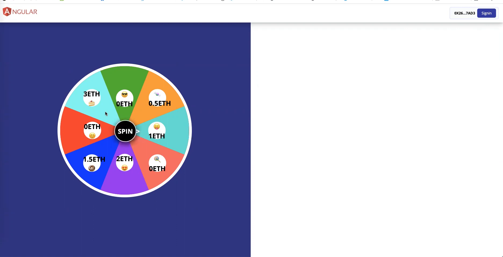
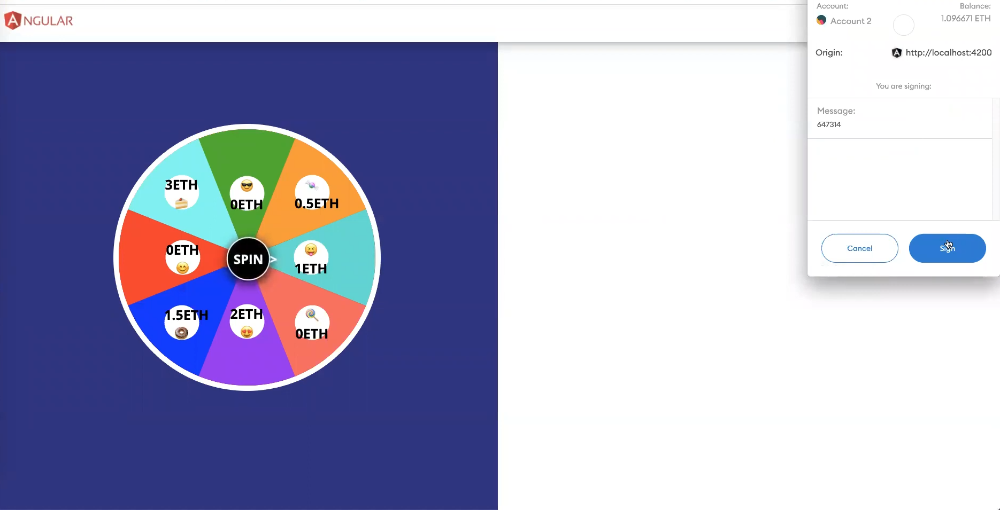
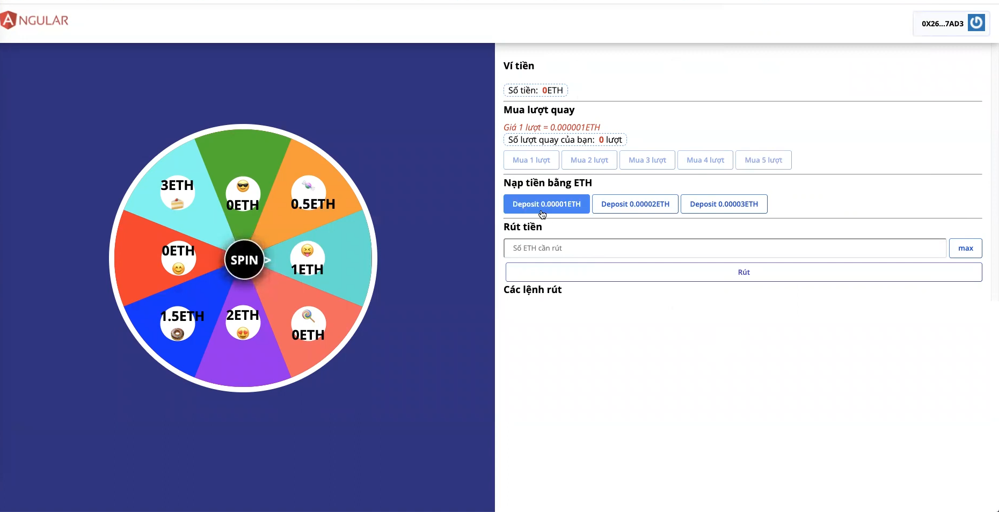
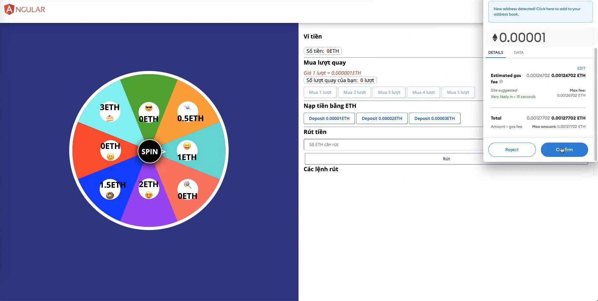
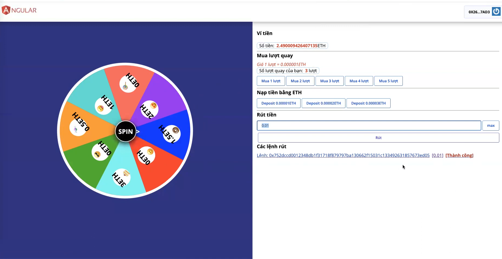

# spin-game

### Feature

- Signin by metamask signature
- Signout by metamask signature
- Deposit by ETH
- Withdraw
- Spin

### TECH
- golang
- angular
- truffle, solidity

### SNAPSHOTS

<!-- https://youtu.be/1UfIbg-erOw -->
[](https://youtu.be/1UfIbg-erOw)
[](https://youtu.be/1UfIbg-erOw)
[](https://youtu.be/1UfIbg-erOw)
[](https://youtu.be/1UfIbg-erOw)
[](https://youtu.be/1UfIbg-erOw)
[](https://youtu.be/1UfIbg-erOw)

```
Copy .env.example into .env
then modify the file
```
